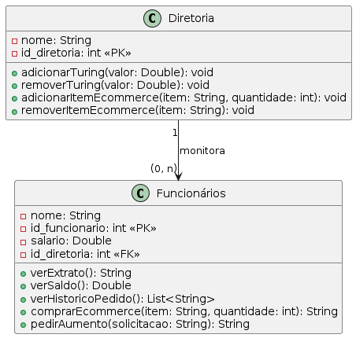
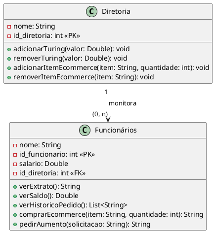

# Higia-Turing

## Diagrama de Classes

## Plant UML

```plantuml
@startuml
class Diretoria {
    -nome: String
    -id_diretoria: int <<PK>>
    +adicionarTuring(valor: Double): void
    +removerTuring(valor: Double): void
    +adicionarItemEcommerce(item: String, quantidade: int): void
    +removerItemEcommerce(item: String): void
    
}

class Funcionários{
    -nome: String
    -id_funcionario: int <<PK>>
    -salario: Double
    -id_diretoria: int <<FK>>
    +verExtrato(): String
    +verSaldo(): Double
    +verHistoricoPedido(): List<String>
    +comprarEcommerce(item: String, quantidade: int): String
    +pedirAumento(solicitacao: String): String
}

Diretoria "1" --> "(0, n)" Funcionários: monitora
@enduml
```

**Pode ser adicionado**

1. +gerarRelatorioFinanceiro(): String